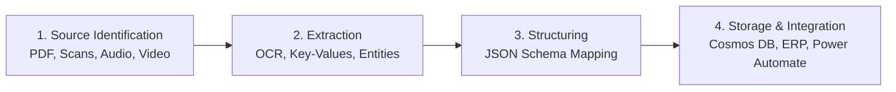
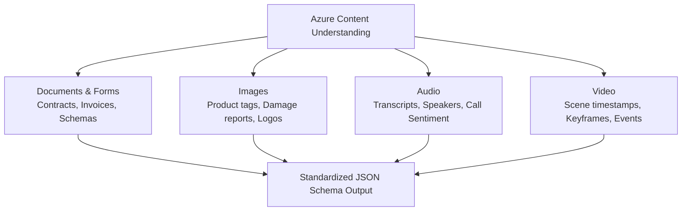

# 06 - Information Extraction & Azure Content Understanding

This module covers information extraction principles, Azure AI Document Intelligence, Azure Content Understanding in Foundry Tools across documents, images, audio, and video, and hands-on Python SDK client implementations for **Exam AI-901: Microsoft Azure AI Fundamentals**.

---

## Table of Contents

- [06 - Information Extraction \& Azure Content Understanding](#06---information-extraction--azure-content-understanding)
  - [Table of Contents](#table-of-contents)
  - [1. Fundamentals of Information Extraction](#1-fundamentals-of-information-extraction)
    - [What is Information Extraction?](#what-is-information-extraction)
    - [The Information Extraction Lifecycle](#the-information-extraction-lifecycle)
  - [2. Azure AI Document Intelligence in Foundry Tools](#2-azure-ai-document-intelligence-in-foundry-tools)
    - [Prebuilt Document Models](#prebuilt-document-models)
    - [Document Analysis Models (Read \& Layout)](#document-analysis-models-read--layout)
    - [Custom Models](#custom-models)
  - [3. Azure Content Understanding in Foundry Tools](#3-azure-content-understanding-in-foundry-tools)
    - [What is Azure Content Understanding?](#what-is-azure-content-understanding)
    - [Multimodal Extraction Across Modalities](#multimodal-extraction-across-modalities)
    - [Custom Analyzers \& Schema Definitions](#custom-analyzers--schema-definitions)
  - [4. Practical Implementation (Python SDK)](#4-practical-implementation-python-sdk)
    - [Workflow 1: Extracting Form Data with Document Intelligence](#workflow-1-extracting-form-data-with-document-intelligence)
    - [Workflow 2: Multimodal Extraction with Content Understanding](#workflow-2-multimodal-extraction-with-content-understanding)
  - [5. Exam Essentials \& Review Points](#5-exam-essentials--review-points)

---

## 1. Fundamentals of Information Extraction

### What is Information Extraction?

**Information extraction (IE)** is the automated process of parsing unstructured or semi-structured data sources (scanned paper documents, receipts, contracts, images, customer service audio calls, and video streams) and transforming them into structured, queryable data formats (such as JSON or database tables).

### The Information Extraction Lifecycle



1. **Source Identification**: Ingesting heterogeneous source media (scanned PDFs, photographs of receipts, MP3 call recordings, MP4 security video).
2. **Extraction**: Using deep learning and multimodal foundation models to extract text, bounding coordinates, key-value pairs, tables, and acoustic/temporal timestamps.
3. **Transformation & Structuring**: Normalizing raw extractions into a validated data schema (e.g., date formats, currency values, vendor tax IDs).
4. **Storage & Integration**: Persisting structured output in enterprise databases and triggering business processes (e.g., automated accounts payable in an ERP system).

---

## 2. Azure AI Document Intelligence in Foundry Tools

**Azure AI Document Intelligence** (formerly Azure Form Recognizer) provides specialized machine learning models for document and form processing.

### Prebuilt Document Models

Pre-trained out of the box on millions of enterprise documents—no custom training required:

| Prebuilt Model | Target Document Type | Key Extracted Fields |
| :--- | :--- | :--- |
| **`prebuilt-invoice`** | Commercial invoices, vendor bills | Invoice ID, Vendor Name, Customer Name, Due Date, Line Items (quantity, unit price, amount), Tax, Total. |
| **`prebuilt-receipt`** | Sales receipts (retail, dining) | Merchant Name, Merchant Address, Transaction Date, Line Items, Subtotal, Tip, Total. |
| **`prebuilt-idDocument`** | Passports, Driver's Licenses, State IDs | First/Last Name, Document Number, Date of Birth, Expiration Date, Country Code, Machine-Readable Zone (MRZ). |
| **`prebuilt-tax.us.w2`** | United States IRS W-2 tax forms | Employee SSN, Employer EIN, Wages, Federal income tax withheld, Social Security wages. |
| **`prebuilt-businessCard`** | Contact business cards | Contact Name, Company, Job Title, Email, Phone Numbers, Physical Address, Websites. |

### Document Analysis Models (Read & Layout)

- **Read Model (`prebuilt-read`)**:
  - High-accuracy OCR engine for scanned and digital documents.
  - Extracts text lines, words, paragraphs, detected languages, and text styles (e.g., handwritten vs. printed).
- **Layout Model (`prebuilt-layout`)**:
  - Extracts document structure.
  - Detects **tables** (rows, columns, cell spans), **selection marks** (radio buttons, check boxes), page boundaries, and reading order.

### Custom Models

When standard prebuilt models do not cover proprietary document formats:
- **Custom Template Model**: Trained on fixed-layout forms (e.g., standardized paper registration questionnaires) with as few as 5 training samples.
- **Custom Neural Model**: Trained on variable-layout documents (e.g., contracts, warranty agreements, complex technical specifications).

---

## 3. Azure Content Understanding in Foundry Tools

A centerpiece of **Exam AI-901**, **Azure Content Understanding** is Microsoft's next-generation multimodal content extraction service within Microsoft Foundry.

### What is Azure Content Understanding?

While Document Intelligence focuses on traditional documents and forms, **Azure Content Understanding** unifies information extraction across **all content modalities**: documents, images, audio, and video using custom schemas and generative foundation models.



### Multimodal Extraction Across Modalities

#### 1. Documents and Forms
- Extracts structured key-value pairs, complex nested tables, and text summaries from PDFs, Microsoft Office files, and scans.
- Formulates extraction according to a user-defined JSON schema with semantic validation.

#### 2. Images
- Extracts visual data, text annotations, object locations, condition assessments, and brand iconography.
- *Example*: In an insurance claim, analyzing photos of a vehicle collision to extract damaged parts, severity ratings, and license plate numbers into a structured JSON claim form.

#### 3. Audio
- Ingests audio files (e.g., customer service phone calls, virtual meetings).
- Generates precise transcriptions, identifies individual speakers (**speaker diarization**), extracts customer sentiment trends, and flags key action items.

#### 4. Video
- Performs temporal video comprehension.
- Detects scene changes, tracks keyframe events, reads text appearing on screens/signs over time, and generates chronological event timelines with exact timestamps.

### Custom Analyzers & Schema Definitions

Developers create **Custom Analyzers** in the Foundry portal or via SDK by supplying:
1. **Target Schema**: The desired fields and their data types (String, Number, Boolean, Array, Object).
2. **Field Descriptions**: Natural language descriptions guiding the underlying model on how to locate and format the extracted values.

*Example Schema Definition*:
```json
{
  "fields": {
    "VendorName": { "type": "string", "description": "Legal company name issuing the document" },
    "TotalAmount": { "type": "number", "description": "Final monetary balance due including taxes" },
    "ComplianceApproved": { "type": "boolean", "description": "True if an authorized signature or stamp is present" }
  }
}
```

---

## 4. Practical Implementation (Python SDK)

### Workflow 1: Extracting Form Data with Document Intelligence

The following script extracts structured key-value pairs and tables from an invoice using the Azure Document Intelligence client library:

```python
import os
from azure.core.credentials import AzureKeyCredential
from azure.ai.documentintelligence import DocumentIntelligenceClient
from azure.ai.documentintelligence.models import AnalyzeDocumentRequest

# 1. Initialize client
endpoint = os.environ.get("DOCUMENT_INTELLIGENCE_ENDPOINT")
key = os.environ.get("DOCUMENT_INTELLIGENCE_KEY")

client = DocumentIntelligenceClient(
    endpoint=endpoint,
    credential=AzureKeyCredential(key)
)

# 2. Analyze document using prebuilt invoice model
invoice_url = "https://raw.githubusercontent.com/Azure-Samples/cognitive-services-REST-api-samples/master/curl/form-recognizer/invoice-sample.pdf"

poller = client.begin_analyze_document(
    model_id="prebuilt-invoice",
    body=AnalyzeDocumentRequest(url_source=invoice_url)
)

result = poller.result()

# 3. Extract key invoice fields
for document in result.documents:
    fields = document.fields
    if "VendorName" in fields:
        print(f"Vendor Name: {fields['VendorName'].content}")
    if "InvoiceTotal" in fields:
        print(f"Invoice Total: {fields['InvoiceTotal'].content}")
    if "DueDate" in fields:
        print(f"Due Date: {fields['DueDate'].content}")

# 4. Extract tables and cells
for table in result.tables:
    print(f"\nExtracted Table ({table.row_count} rows x {table.column_count} cols):")
    for cell in table.cells:
        print(f" - Row {cell.row_index}, Col {cell.column_index}: {cell.content}")
```

### Workflow 2: Multimodal Extraction with Content Understanding

Using Azure Content Understanding client code to analyze multimodal content against a predefined schema:

```python
import os
import requests

# 1. Endpoint and Authorization
endpoint = os.environ.get("CONTENT_UNDERSTANDING_ENDPOINT")
api_key = os.environ.get("CONTENT_UNDERSTANDING_KEY")
analyzer_id = "damage-assessment-analyzer"

url = f"{endpoint}/contentunderstanding/analyzers/{analyzer_id}:analyze?api-version=2024-12-01-preview"

headers = {
    "Ocp-Apim-Subscription-Key": api_key,
    "Content-Type": "application/json"
}

# 2. Submit target image or document for multimodal extraction
payload = {
    "url": "https://example.com/damaged-car.jpg"
}

response = requests.post(url, headers=headers, json=payload)
result = response.json()

# 3. Retrieve structured schema values
extracted_fields = result.get("result", {}).get("fields", {})
print("Extracted Structured Fields:")
for field_name, field_data in extracted_fields.items():
    print(f" - {field_name}: {field_data.get('value')} (Confidence: {field_data.get('confidence'):.2f})")
```

---

## 5. Exam Essentials & Review Points

- [ ] **Content Understanding Modalities**: Azure Content Understanding is the unified Foundry service for **Documents, Images, Audio, and Video**.
- [ ] **Prebuilt vs. Custom in Document Intelligence**: Prebuilt models (`prebuilt-invoice`, `prebuilt-receipt`, `prebuilt-idDocument`) require zero training; Custom models are used for proprietary forms.
- [ ] **Read vs. Layout Model**: Read extracts raw text lines and words (OCR); Layout extracts tables, reading order, and checkboxes/selection marks.
- [ ] **Speaker Diarization**: The process in audio extraction of identifying distinct speaker identities over time (*"Who spoke when"*).
