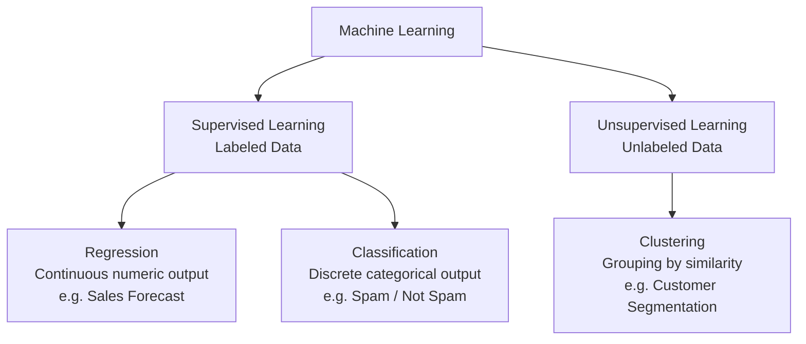
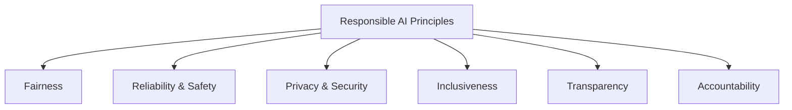
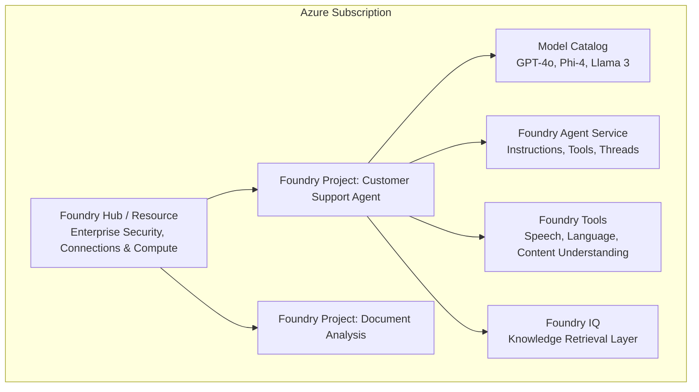

> [!WARNING]
> **Archived.** These notes predate the current AI-901 content and contain a few things
> Microsoft has since changed. The verified, up-to-date version is the interactive site in
> this repository. See [notes/README.md](./README.md) for the specific corrections.

# 01 - AI Overview, Responsible AI & Microsoft Foundry

This module covers the core concepts, foundational techniques, responsible AI principles, and platform architecture required for **Exam AI-901: Microsoft Azure AI Fundamentals**.

---

## Table of Contents

- [01 - AI Overview, Responsible AI \& Microsoft Foundry](#01---ai-overview-responsible-ai--microsoft-foundry)
  - [Table of Contents](#table-of-contents)
  - [1. What is Artificial Intelligence (AI)?](#1-what-is-artificial-intelligence-ai)
  - [2. Common AI Workloads](#2-common-ai-workloads)
  - [3. Foundational Machine Learning \& Deep Learning Concepts](#3-foundational-machine-learning--deep-learning-concepts)
    - [Features and Labels](#features-and-labels)
    - [Training vs. Inferencing](#training-vs-inferencing)
    - [Supervised vs. Unsupervised Learning](#supervised-vs-unsupervised-learning)
    - [Deep Learning \& Neural Networks](#deep-learning--neural-networks)
    - [The Transformer Architecture](#the-transformer-architecture)
  - [4. Principles of Responsible AI](#4-principles-of-responsible-ai)
    - [The Six Principles at a Glance](#the-six-principles-at-a-glance)
    - [Deep Dive into Each Principle](#deep-dive-into-each-principle)
  - [5. Microsoft Foundry Platform Architecture](#5-microsoft-foundry-platform-architecture)
    - [What is Microsoft Foundry?](#what-is-microsoft-foundry)
    - [Hierarchy: Subscriptions, Hubs, and Projects](#hierarchy-subscriptions-hubs-and-projects)
    - [Key Foundry Components](#key-foundry-components)
  - [6. Exam Essentials \& Review Points](#6-exam-essentials--review-points)

---

## 1. What is Artificial Intelligence (AI)?

**Artificial Intelligence (AI)** refers to software systems that simulate human capabilities and cognitive functions, enabling machines to perceive their environment, learn from experience, make reasoned decisions, and perform tasks autonomously.

Key human capabilities that AI emulates:
- **Perceiving**: Interpreting visual input (images, video), acoustic signals (speech, audio), and sensory data.
- **Understanding**: Processing natural language, extracting intent, recognizing semantic relationships, and comprehending nuances.
- **Reasoning**: Evaluating options, formulating plans, identifying patterns, and solving problems.
- **Learning**: Adapting behavior based on historical data, feedback loops, and newly observed examples.
- **Generating**: Producing novel text, code, images, audio, and synthetic data that mirror human creativity.

---

## 2. Common AI Workloads

Exam AI-901 categorizes modern AI workloads into six primary domains:

| Workload | Description | Example Real-World Scenarios |
| :--- | :--- | :--- |
| **Generative AI** | Creating original content (text, code, photorealistic images, synthetic audio/video) based on learned patterns from massive datasets. | Drafting emails, summarizing reports, generating creative artwork, creating marketing copy. |
| **Agentic AI** | Goal-oriented systems that combine foundation models with instructions, memory, and external tools to accomplish multi-step workflows autonomously. | Customer service agents that look up orders, process refunds via APIs, and notify the warehouse. |
| **Natural Language Processing (NLP)** | Analyzing, understanding, and extracting meaning from written human text. | Sentiment analysis on customer reviews, language translation, key phrase extraction, named entity recognition. |
| **Speech Processing** | Converting spoken audio into written text (Speech-to-Text) and synthesizing natural-sounding spoken audio from text (Text-to-Speech). | Real-time call transcription, in-car voice assistants, screen-readers for visually impaired users. |
| **Computer Vision** | Processing, analyzing, and extracting semantic understanding from visual inputs such as images and video streams. | Defect detection on manufacturing lines, autonomous vehicle lane detection, optical character recognition (OCR) on street signs. |
| **Information Extraction** | Transforming unstructured content (scanned forms, receipts, video recordings, customer phone calls) into structured, queryable data schemas. | Automated invoice processing, medical records digitalization, extracting topics and speakers from meeting recordings. |

---

## 3. Foundational Machine Learning & Deep Learning Concepts

Machine learning (ML) is the computational backbone of modern AI. Understanding foundational ML mechanics is essential for understanding how foundation models and generative AI operate.

### Features and Labels

Machine learning models learn mathematical relationships between **features** and **labels**:
- **Features ($X$)**: The input variables or attributes describing the data (e.g., house square footage, number of bedrooms, location zip code).
- **Label ($y$)**: The target variable the model attempts to predict (e.g., sale price of the house).
- In unlabeled datasets (unsupervised learning), only features exist without assigned labels.

### Training vs. Inferencing

- **Training**: The iterative process where an algorithm analyzes training data, computes predictions, calculates error (loss), and adjusts internal weights/parameters until predictions closely align with ground truth labels.
- **Validation & Testing**: Evaluating the trained model against held-out, unseen datasets to verify generalization and detect overfitting.
- **Inferencing**: Deploying the trained model to production to make predictions or generate outputs on live, new inputs.

### Supervised vs. Unsupervised Learning

- **Supervised Learning**:
  - **Regression**: Predicts continuous numerical values (e.g., predicting temperature, stock prices, or delivery times).
  - **Classification**: Predicts discrete categorical labels.
    - *Binary Classification*: Two possible classes (e.g., Diabetic: Yes/No; Fraudulent: True/False).
    - *Multiclass Classification*: More than two mutually exclusive classes (e.g., Animal: Cat, Dog, Bird).
- **Unsupervised Learning**:
  - **Clustering**: Discovers natural groupings and patterns without predefined labels (e.g., grouping e-commerce shoppers based on purchasing frequency and cart size).

### Deep Learning & Neural Networks

**Deep Learning** is a specialized subset of machine learning based on **Artificial Neural Networks (ANNs)** with multiple hidden layers (hence "deep").

- **Neurons (Nodes)**: Receive inputs, multiply them by learned **weights**, add a **bias**, and apply an **activation function** to produce an output signal.
- **Layers**:
  - *Input Layer*: Receives raw features (e.g., pixel brightness or token IDs).
  - *Hidden Layers*: Hierarchically extract increasingly abstract representations (e.g., edges $\rightarrow$ shapes $\rightarrow$ facial features).
  - *Output Layer*: Produces final classification probabilities or continuous predictions.

### The Transformer Architecture

The **Transformer** (introduced in 2017) revolutionized modern AI and forms the architectural foundation for all modern Large Language Models (LLMs) and vision foundation models:

- **Self-Attention Mechanism**: Computes mathematical correlation scores between all tokens in an input sequence simultaneously, enabling the model to capture long-range contextual relationships regardless of distance.
- **Parallel Processing**: Unlike recurrent neural networks (RNNs) that process text sequentially word-by-word, transformers process entire sequences in parallel, dramatically accelerating training on massive GPU clusters.
- **Encoder-Decoder Structure**:
  - *Encoder*: Processes input sequences and builds rich semantic representations (e.g., BERT for classification and embeddings).
  - *Decoder*: Auto-regressively generates output sequences one token at a time based on the encoder representations and previously generated tokens (e.g., GPT for text generation).

---

## 4. Principles of Responsible AI

Microsoft has established six core principles for developing and deploying ethical, trustworthy AI systems. These principles are heavily tested in Exam AI-901 through scenario-based questions.

### The Six Principles at a Glance

### Deep Dive into Each Principle

#### 1. Fairness
- **Core Requirement**: AI systems must treat all people fairly and equitably without discrimination based on gender, ethnicity, race, age, disability, or other protected characteristics.
- **Risk Scenario**: A loan approval model approves loans for male applicants at a significantly higher rate than similarly qualified female applicants due to historical demographic bias in the training data.
- **Mitigation**: Audit training data for demographic representation, evaluate error rates across sub-populations, and apply fairness metrics during model evaluation.

#### 2. Reliability and Safety
- **Core Requirement**: AI systems must perform reliably, safely, and consistently under both expected operational conditions and unexpected edge cases.
- **Risk Scenario**: An autonomous vehicle software fails to detect pedestrians wearing dark clothing during heavy rainfall, or an AI medical diagnostics tool generates erratic diagnoses when sensor readings fluctuate slightly.
- **Mitigation**: Conduct rigorous testing across adverse conditions, implement automated safety guardrails, define operational operational thresholds, and allow human intervention fallbacks.

#### 3. Privacy and Security
- **Core Requirement**: AI systems must safeguard user privacy, comply with data protection regulations (GDPR, HIPAA, etc.), and protect proprietary and sensitive data against adversarial attacks.
- **Risk Scenario**: A customer support chatbot inadvertently reveals another customer's personally identifiable information (PII) or confidential payment details in its responses.
- **Mitigation**: Implement role-based access control (RBAC), data masking/redaction of PII, end-to-end encryption in transit and at rest, and evaluate models against prompt injection or data exfiltration attacks.

#### 4. Inclusiveness
- **Core Requirement**: AI systems must empower and engage everyone, accommodating a wide spectrum of human capabilities, disabilities, languages, and cultural backgrounds.
- **Risk Scenario**: A public service portal deploys a voice-only conversational agent that cannot be utilized by hearing-impaired citizens or individuals with non-standard speech patterns.
- **Mitigation**: Follow accessibility standards (WCAG), provide multimodal input/output options (speech + captions + text), and support multiple languages and locales.

#### 5. Transparency
- **Core Requirement**: AI systems should be understandable. Users must be explicitly informed when they are interacting with an AI system, and stakeholders should understand the system's capabilities, limitations, and underlying data sources.
- **Risk Scenario**: Users assume a medical advisory chatbot is a licensed human physician and take unverified medical action without realizing the advice was generated probabilistically by an LLM.
- **Mitigation**: Display prominent disclosures (e.g., *"Generated by AI"*), publish system transparency notes, provide citation links for generated facts, and document model capabilities and limitations.

#### 6. Accountability
- **Core Requirement**: The people who design, develop, and deploy AI systems must be accountable for how their systems operate and the societal impact they produce.
- **Risk Scenario**: An organization deploys an automated hiring system that unjustly screens out candidates, but management claims "the algorithm made the decision" with no human oversight or recourse.
- **Mitigation**: Establish clear human-in-the-loop governance structures, designate executive ownership, establish appeals processes, and conduct ongoing algorithmic impact assessments.

---

## 5. Microsoft Foundry Platform Architecture

In Exam AI-901, **Microsoft Foundry** (formerly Azure AI Foundry / Azure AI Studio) is the central platform for designing, customizing, evaluating, and deploying AI applications and agents.

### What is Microsoft Foundry?

Microsoft Foundry brings together foundation models from Microsoft, OpenAI, Meta, Mistral, and the open-source ecosystem, alongside managed developer tools, agent runtimes, and enterprise safety guardrails into a single unified portal (`https://ai.azure.com`).

### Hierarchy: Subscriptions, Hubs, and Projects

1. **Azure Subscription**: The billing and high-level identity boundary in Azure.
2. **Foundry Hub (Resource)**:
   - Serves as the top-level container for governance, security, and compliance.
   - Manages shared Azure resources: Azure Storage (for files/datasets), Azure Key Vault (for API keys/secrets), Azure Container Registry (for custom environments), and network isolation (VNet / Private Endpoints).
   - Defines shared connections to data sources and external services.
3. **Foundry Projects**:
   - Lightweight workspaces created within a Hub for team collaboration on specific AI applications.
   - Houses deployed models, prompt engineering experiments, agent definitions, evaluation runs, and code assets.
   - Multiple projects can share the same parent Hub without duplicating enterprise security setup.

### Key Foundry Components

| Component | Description & Role in AI-901 |
| :--- | :--- |
| **Model Catalog** | A comprehensive directory of foundation models across publishers (OpenAI, Microsoft Research, Meta, Mistral, Cohere, Hugging Face). Supports 1-click deployment as Serverless APIs or Managed Compute. |
| **Foundry Playgrounds** | Web-based interactive testing interfaces in the Foundry portal: Chat Playground, Completions Playground, Vision Playground, and Speech Playground. |
| **Foundry Agent Service** | A managed runtime for building, testing, and running stateful AI agents with built-in tool support (Code Interpreter, File Search, custom functions). |
| **Foundry IQ** | The managed knowledge retrieval layer (built on Azure AI Search) that powers Retrieval-Augmented Generation (RAG) for agents with citation-backed responses. |
| **Foundry Tools** | Pre-integrated AI capabilities accessible from Foundry, including: Azure AI Language, Azure Speech in Foundry Tools, and Azure Content Understanding. |
| **Azure AI Content Safety** | Built-in enterprise guardrails that detect and filter hate speech, violence, sexual content, self-harm, and prompt injection attacks in real time. |

---

## 6. Exam Essentials & Review Points

- [ ] **AI Workload Identification**: Know which AI workload matches a given scenario (e.g., document extraction $\rightarrow$ Information Extraction; automated multi-step booking $\rightarrow$ Agentic AI; real-time audio translation $\rightarrow$ Speech Processing).
- [ ] **Responsible AI Principles**: Be prepared to identify which principle is violated in a scenario (e.g., lack of user notice $\rightarrow$ Transparency; unequal error rates $\rightarrow$ Fairness; unencrypted customer chat logs $\rightarrow$ Privacy & Security).
- [ ] **Transformer Architecture**: Understand that the self-attention mechanism enables simultaneous processing of context across an entire sequence.
- [ ] **Foundry Hub vs. Project**: Understand that enterprise security, storage, and shared connections are configured at the **Hub** level, while individual experiments, model deployments, and agents live in the **Project**.
