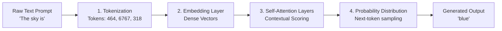
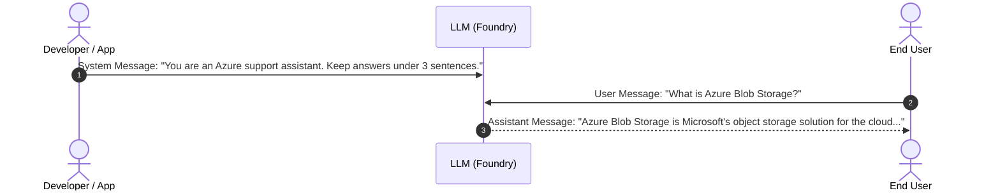
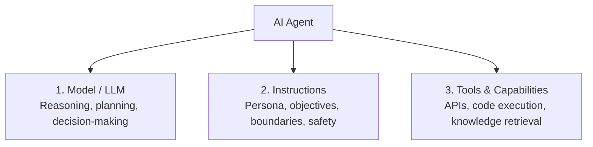

> [!WARNING]
> **Archived.** These notes predate the current AI-901 content and contain a few things
> Microsoft has since changed. The verified, up-to-date version is the interactive site in
> this repository. See [notes/README.md](./README.md) for the specific corrections.

# 02 - Generative AI Models, Prompt Engineering & AI Agents

This module covers generative AI mechanics, foundation model selection, deployment configurations, prompt engineering, agentic architecture, and hands-on client development in Microsoft Foundry for **Exam AI-901: Microsoft Azure AI Fundamentals**.

---

## Table of Contents

- [02 - Generative AI Models, Prompt Engineering \& AI Agents](#02---generative-ai-models-prompt-engineering--ai-agents)
  - [Table of Contents](#table-of-contents)
  - [1. How Generative AI Models Work](#1-how-generative-ai-models-work)
    - [The Generative Pipeline](#the-generative-pipeline)
    - [LLMs vs. SLMs (Large vs. Small Language Models)](#llms-vs-slms-large-vs-small-language-models)
  - [2. Model Selection in Microsoft Foundry](#2-model-selection-in-microsoft-foundry)
    - [Model Types \& Capabilities](#model-types--capabilities)
    - [Foundry Model Catalog](#foundry-model-catalog)
  - [3. Model Deployment Options \& Configuration Parameters](#3-model-deployment-options--configuration-parameters)
    - [Deployment Options](#deployment-options)
    - [Configuration Parameters (Exam Critical)](#configuration-parameters-exam-critical)
  - [4. Prompt Engineering Principles](#4-prompt-engineering-principles)
    - [Message Roles: System, User, and Assistant](#message-roles-system-user-and-assistant)
    - [Prompting Techniques](#prompting-techniques)
  - [5. AI Agents Architecture](#5-ai-agents-architecture)
    - [The Three Pillars of an Agent](#the-three-pillars-of-an-agent)
    - [Available Agent Tools in Foundry](#available-agent-tools-in-foundry)
  - [6. Practical Implementation in Microsoft Foundry](#6-practical-implementation-in-microsoft-foundry)
    - [Workflow 1: Deploying a Model in the Foundry Portal](#workflow-1-deploying-a-model-in-the-foundry-portal)
    - [Workflow 2: Lightweight Chat Client (Python SDK)](#workflow-2-lightweight-chat-client-python-sdk)
    - [Workflow 3: Creating a Single-Agent in Foundry Portal](#workflow-3-creating-a-single-agent-in-foundry-portal)
    - [Workflow 4: Lightweight Agent Client (Python SDK)](#workflow-4-lightweight-agent-client-python-sdk)
  - [7. Exam Essentials \& Review Points](#7-exam-essentials--review-points)

---

## 1. How Generative AI Models Work

Generative AI models are trained on vast corpora of text, code, images, and multimodal data to learn statistical distributions and semantic structures, enabling them to generate novel, contextually relevant outputs in response to user prompts.

### The Generative Pipeline



1. **Tokenization**:
   - Raw text is converted into smaller numerical chunks called **tokens** (roughly 4 characters or 0.75 words in English).
   - Example: `"Exploring AI"` might be tokenized into `["Explor", "ing", " AI"]` with IDs `[15320, 278, 9552]`.
2. **Embedding**:
   - Each token ID is mapped to a high-dimensional vector (e.g., 1,536 or 3,072 dimensions) representing its semantic meaning in mathematical space.
   - Tokens with similar semantic meanings or contextual usage are located closer together in vector space.
3. **Self-Attention & Transformer Processing**:
   - The model analyzes all tokens in the sequence simultaneously.
   - Attention weights calculate how much focus each token should give to every other token, capturing grammar, context, and long-range dependencies.
4. **Auto-Regressive Generation (Decoding)**:
   - The model outputs a probability distribution over the entire vocabulary for the next most likely token.
   - A token is selected based on sampling parameters (`temperature`, `top_p`), appended to the sequence, and the process repeats until a stop condition or maximum token limit is reached.

### LLMs vs. SLMs (Large vs. Small Language Models)

| Characteristic | Large Language Models (LLMs) | Small Language Models (SLMs) |
| :--- | :--- | :--- |
| **Examples** | GPT-4o, Llama 3 70B, Mistral Large | Microsoft Phi-3 / Phi-4, Mistral 7B, Llama 3 8B |
| **Parameter Count** | Typically tens or hundreds of billions | Typically 1 to 14 billion parameters |
| **Hardware Requirements** | High-end GPU clusters in cloud data centers | Low compute footprint; runs on modest GPUs, laptops, or edge devices |
| **Latency & Cost** | Higher latency, higher per-token inference cost | Extremely low latency, highly cost-efficient |
| **Best For** | Complex multi-step reasoning, nuanced translation, advanced coding, comprehensive domain synthesis | Specific focused tasks, edge deployment, offline scenarios, summarization, high-throughput classification |

---

## 2. Model Selection in Microsoft Foundry

The **Microsoft Foundry Model Catalog** acts as an enterprise app store for state-of-the-art foundation models.

### Model Types & Capabilities

- **Language & Reasoning Models**: Text-in, text-out models capable of conversation, reasoning, and instruction following (e.g., GPT-4o, GPT-4o-mini, Phi-4).
- **Multimodal Models**: Capable of processing combinations of text, high-resolution images, audio, and video in the same prompt (e.g., GPT-4o).
- **Embedding Models**: Convert text into dense numerical vectors for semantic search, clustering, and RAG pipelines (e.g., `text-embedding-3-small`, `text-embedding-3-large`).
- **Image Generation Models**: Convert natural language descriptions into high-resolution images (e.g., DALL-E 3).

### Foundry Model Catalog

Foundry organizes models by publisher and licensing:
- **OpenAI Models**: Hosted directly through Azure OpenAI Service integration with enterprise SLAs.
- **Microsoft Research Models**: Open-weight foundation models (e.g., Phi family) optimized for efficiency.
- **Open-source & Partner Models**: Models from Meta (Llama), Mistral AI, Cohere, and Hugging Face.

---

## 3. Model Deployment Options & Configuration Parameters

### Deployment Options

1. **Serverless API (Pay-as-you-go / Models as a Service - MaaS)**:
   - Zero infrastructure management.
   - Billed strictly per 1,000 input/output tokens consumed.
   - Recommended for prototyping, development, and workloads with variable or unpredictable traffic.
2. **Managed Compute**:
   - Deploys the model to dedicated Azure Virtual Machine compute instances.
   - Billed hourly for the underlying VM compute regardless of usage.
   - Ideal for specialized open-source models requiring customized hosting environments.
3. **Provisioned Throughput Units (PTU)**:
   - Reserved model processing capacity in Azure OpenAI for steady, high-volume production workloads requiring guaranteed latency and throughput SLAs.

### Configuration Parameters (Exam Critical)

When calling an inference endpoint, developers can fine-tune output generation:

| Parameter | Type & Range | Description & Exam Impact |
| :--- | :--- | :--- |
| **`temperature`** | Float (`0.0` to `2.0`) | **Controls randomness**. Lower values (e.g., `0.0`–`0.2`) make output focused, deterministic, and analytical. Higher values (e.g., `0.8`–`1.0`) make output creative, diverse, and unexpected. |
| **`top_p`** (Nucleus Sampling) | Float (`0.0` to `1.0`) | **Probability mass threshold**. An alternative to temperature. `top_p = 0.1` means only tokens comprising the top 10% probability mass are considered. *Rule: Modify `temperature` OR `top_p`, not both.* |
| **`max_tokens`** | Integer (`1` to max context) | Sets the hard ceiling on the maximum number of tokens the model can generate in the completion. Does not restrict prompt length. |
| **`stop`** (Stop Sequences) | Array of strings | Specific tokens or character sequences that signal the model to cease generating text immediately (e.g., `["\n\n", "User:", "END"]`). |
| **`frequency_penalty`** | Float (`-2.0` to `2.0`) | Penalizes tokens based on their existing frequency in the text so far. Positive values discourage the model from repeating the same words or phrases verbatim. |
| **`presence_penalty`** | Float (`-2.0` to `2.0`) | Penalizes tokens based on whether they have appeared in the text at all. Positive values encourage the model to introduce fresh topics. |

---

## 4. Prompt Engineering Principles

**Prompt engineering** is the practice of structuring text inputs to guide generative AI models toward accurate, desired outputs without modifying model weights.

### Message Roles: System, User, and Assistant

Modern chat completion models expect messages structured into explicit roles:



- **System Message**: Defines the persona, guidelines, boundaries, output format, and security constraints. Set by the developer.
- **User Message**: The current query or instruction submitted by the end user.
- **Assistant Message**: Prior responses generated by the model, included in subsequent requests to provide conversational history.

### Prompting Techniques

1. **Zero-Shot Prompting**: Presenting a task to the model without providing any examples.
   ```text
   Classify the sentiment of this review as Positive, Neutral, or Negative:
   "The delivery arrived two days early and the packaging was spotless."
   ```
2. **Few-Shot Prompting**: Providing a small number of demonstration input-output pairs to establish patterns, style, and formatting.
   ```text
   Text: "Battery drains in 2 hours." -> Label: Hardware
   Text: "Cannot reset password." -> Label: Account
   Text: "Screen flickers on startup." -> Label: 
   ```
3. **Chain-of-Thought (CoT) Prompting**: Directing the model to break complex reasoning tasks into intermediate, step-by-step calculations before stating the final answer (*"Think step by step"*).

---

## 5. AI Agents Architecture

An **AI Agent** is an autonomous system that uses a foundation model as its reasoning engine, augmented with memory, instructions, and tools to execute complex workflows.

### The Three Pillars of an Agent



1. **Model**: Provides the cognitive capabilities to understand user goals, break problems into sub-tasks, and determine which tool to invoke.
2. **Instructions**: Defines who the agent is, its goals, operating principles, constraints, and when it should escalate to a human.
3. **Tools**: Functions that allow the agent to interact with external data sources and execution environments.

### Available Agent Tools in Foundry

- **Code Interpreter**: Runs sandboxed Python code to solve math problems, process CSV files, and generate charts.
- **File Search / Knowledge Base**: Queries indexed documents using Foundry IQ to retrieve grounded factual context.
- **Bing Search**: Connects the agent to live internet data for current events and external verification.
- **Function Calling / OpenAPI Tools**: Custom REST endpoints allowing the agent to query internal databases, create CRM tickets, or trigger external workflows.

---

## 6. Practical Implementation in Microsoft Foundry

Exam AI-901 requires practical familiarity with both the Foundry portal interface and Python SDK client implementations.

### Workflow 1: Deploying a Model in the Foundry Portal

1. Navigate to **Microsoft Foundry Portal** (`https://ai.azure.com`) and open your **Project**.
2. In the left navigation menu under **My assets**, select **Models + endpoints**.
3. Select **+ Deploy model** $\rightarrow$ **Deploy base model**.
4. Search for the desired model (e.g., `gpt-4o-mini` or `Phi-4`) in the catalog.
5. Select **Confirm**, choose **Serverless API with Pay-as-you-go**, specify an endpoint deployment name, and click **Deploy**.
6. Once provisioned, copy the **Target URI** and **API Key** from the endpoint details page.

### Workflow 2: Lightweight Chat Client (Python SDK)

Candidates should be familiar with the Python code structure used to communicate with deployed models using the official `azure-ai-inference` or `azure-ai-projects` client libraries:

```python
import os
from azure.ai.inference import ChatCompletionsClient
from azure.ai.inference.models import SystemMessage, UserMessage
from azure.core.credentials import AzureKeyCredential

# 1. Initialize client with endpoint and authentication key
endpoint = os.environ.get("AZURE_AI_FOUNDRY_ENDPOINT")
api_key = os.environ.get("AZURE_AI_FOUNDRY_KEY")

client = ChatCompletionsClient(
    endpoint=endpoint,
    credential=AzureKeyCredential(api_key)
)

# 2. Construct messages with explicit roles
messages = [
    SystemMessage(content="You are a helpful IT support assistant. Answer concisely."),
    UserMessage(content="Explain what an AI agent is in two sentences.")
]

# 3. Call the deployed model with configuration parameters
response = client.complete(
    messages=messages,
    temperature=0.7,
    max_tokens=150,
    top_p=0.95
)

# 4. Extract and display the generated response
print(response.choices[0].message.content)
```

### Workflow 3: Creating a Single-Agent in Foundry Portal

1. In your Foundry Project, navigate to **Build** $\rightarrow$ **Agents**.
2. Select **+ Create Agent**.
3. Configure the agent settings:
   - **Name**: e.g., `support-triage-agent`
   - **Deployment / Model**: Select your deployed model (e.g., `gpt-4o`).
   - **Instructions**: Define the system prompt (e.g., *"You are a tier-1 customer support triage agent. Collect user issue details and output structured ticket summaries."*).
   - **Tools**: Enable **Code Interpreter** or attach an uploaded document via **Knowledge**.
4. Test the agent interactively in the **Agent Playground** by submitting user prompts and inspecting tool call logs.

### Workflow 4: Lightweight Agent Client (Python SDK)

To interact with Foundry agents programmatically using the `azure-ai-projects` SDK:

```python
import os
from azure.ai.projects import AIProjectClient
from azure.identity import DefaultAzureCredential

# 1. Connect to the Foundry project using connection string
connection_string = os.environ.get("PROJECT_CONNECTION_STRING")
project_client = AIProjectClient.from_connection_string(
    credential=DefaultAzureCredential(),
    conn_str=connection_string
)

# 2. Retrieve the existing agent created in Foundry
agent_id = os.environ.get("AGENT_ID")
agent = project_client.agents.get_agent(agent_id)

# 3. Create a stateful conversation thread
thread = project_client.agents.create_thread()

# 4. Post a user message to the thread
project_client.agents.create_message(
    thread_id=thread.id,
    role="user",
    content="Calculate the monthly amortization payment for a $200,000 loan at 5% interest over 30 years."
)

# 5. Execute a run and poll until completion
run = project_client.agents.create_and_process_run(
    thread_id=thread.id,
    assistant_id=agent.id
)

# 6. Retrieve and display the agent's messages
messages = project_client.agents.list_messages(thread_id=thread.id)
for message in messages:
    print(f"{message.role}: {message.content[0].text.value}")
```

---

## 7. Exam Essentials & Review Points

- [ ] **Temperature Behavior**: Remember that `0.0` is deterministic and repeatable, while `1.0+` is creative and random.
- [ ] **Temperature vs. Top_p**: Do not adjust both simultaneously in production; tune one while keeping the other constant.
- [ ] **Max Tokens Limitation**: Max tokens sets an upper bound on *generated output*, not prompt length.
- [ ] **SLM Scenarios**: Choose SLMs (like Phi-4) when low cost, minimal compute, edge/on-device hosting, or ultra-low latency are required.
- [ ] **Agent Architecture**: Remember that an AI Agent requires **Model + Instructions + Tools**.
- [ ] **Serverless API vs. Managed Compute**: Serverless API is billed per token; Managed Compute is billed per VM hour.
