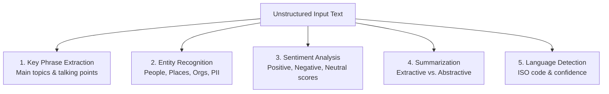

> [!WARNING]
> **Archived.** These notes predate the current AI-901 content and contain a few things
> Microsoft has since changed. The verified, up-to-date version is the interactive site in
> this repository. See [notes/README.md](./README.md) for the specific corrections.

# 03 - Natural Language Processing & Text Analysis

This module covers natural language processing concepts, text analysis techniques, Azure AI Language integration, and hands-on Python client implementations in Microsoft Foundry for **Exam AI-901: Microsoft Azure AI Fundamentals**.

---

## Table of Contents

- [03 - Natural Language Processing \& Text Analysis](#03---natural-language-processing--text-analysis)
  - [Table of Contents](#table-of-contents)
  - [1. Introduction to Natural Language Processing (NLP)](#1-introduction-to-natural-language-processing-nlp)
    - [What is NLP?](#what-is-nlp)
    - [Text Preprocessing Concepts](#text-preprocessing-concepts)
  - [2. Core Text Analysis Techniques](#2-core-text-analysis-techniques)
    - [Key Phrase Extraction](#key-phrase-extraction)
    - [Named Entity Recognition (NER)](#named-entity-recognition-ner)
    - [Sentiment Analysis \& Opinion Mining](#sentiment-analysis--opinion-mining)
    - [Text Summarization (Extractive vs. Abstractive)](#text-summarization-extractive-vs-abstractive)
    - [Language Detection \& Translation](#language-detection--translation)
  - [3. Azure AI Language in Foundry Tools](#3-azure-ai-language-in-foundry-tools)
    - [Prebuilt vs. Custom Capabilities](#prebuilt-vs-custom-capabilities)
    - [Foundry Tools Integration](#foundry-tools-integration)
  - [4. Practical Implementation (Python SDK)](#4-practical-implementation-python-sdk)
    - [Lightweight Text Analysis Application](#lightweight-text-analysis-application)
  - [5. Exam Essentials \& Review Points](#5-exam-essentials--review-points)

---

## 1. Introduction to Natural Language Processing (NLP)

### What is NLP?

**Natural Language Processing (NLP)** is the branch of artificial intelligence that enables computers to understand, interpret, synthesize, and manipulate human language. NLP bridges human communication and computational understanding by combining computational linguistics, statistical modeling, and deep learning.

### Text Preprocessing Concepts

Before text can be analyzed by statistical or machine learning models, it is traditionally preprocessed through fundamental techniques:
- **Tokenization**: Segmenting running sentences into individual words, symbols, or sub-word tokens.
- **Normalization**: Converting characters to a consistent format (e.g., lowercasing, stripping punctuation, resolving unicode inconsistencies).
- **Stop-Word Removal**: Filtering out frequent words that carry minimal semantic value (e.g., *"the"*, *"is"*, *"at"*, *"which"*).
- **Stemming and Lemmatization**: Reducing words to their root form.
  - *Stemming*: Heuristic chopping of affixes (e.g., `"running"` $\rightarrow$ `"run"`, `"ponies"` $\rightarrow$ `"poni"`).
  - *Lemmatization*: Morphological analysis returning the dictionary base form (e.g., `"better"` $\rightarrow$ `"good"`, `"saw"` $\rightarrow$ `"see"`).
- **N-Grams**: Contiguous sequences of $n$ items from a given sample of text (e.g., bigrams: `["cloud", "computing"]`, `["machine", "learning"]`).

---

## 2. Core Text Analysis Techniques

Exam AI-901 tests your understanding of the specific use cases, outputs, and distinctions between five primary text analysis techniques:



### Key Phrase Extraction

- **Purpose**: Quickly identifies the main talking points, topics, or themes in a body of text.
- **Output**: An unordered list of string phrases representing salient concepts.
- **Typical Use Cases**: Cataloging article subjects, identifying common themes in customer feedback surveys, document tagging.
- **Example**:
  - *Input*: `"The new Seattle data center dramatically reduced our cloud latency and improved system reliability."`
  - *Extracted Key Phrases*: `["Seattle data center", "cloud latency", "system reliability"]`.

### Named Entity Recognition (NER)

- **Purpose**: Identifies and categorizes specific named elements in unstructured text into predefined classes.
- **Entity Categories**:
  - **Person**: e.g., `"Satya Nadella"`
  - **Location**: e.g., `"Redmond, Washington"`
  - **Organization**: e.g., `"Microsoft Corporation"`
  - **DateTime**: e.g., `"October 15, 2026"`
  - **Quantity / Number**: e.g., `"500 gigabytes"`, `"$1,200"`
  - **Personally Identifiable Information (PII)**: e.g., Social Security Numbers, Credit Card Numbers, email addresses, phone numbers.
- **Typical Use Cases**: Compliance redaction of sensitive PII, automated data enrichment, knowledge graph generation.

### Sentiment Analysis & Opinion Mining

- **Sentiment Analysis**:
  - Evaluates text to determine whether the emotional tone is **Positive**, **Neutral**, or **Negative**.
  - Returns numeric confidence scores between `0.0` and `1.0` for each sentiment category, along with an overall document-level label and individual sentence-level labels.
- **Opinion Mining (Aspect-Based Sentiment Analysis)**:
  - Drills down to specific aspects/targets of products or services and pairs them with sentiment assessments.
  - *Example*: `"The camera quality is superb, but the battery life is appalling."`
    - Target: `"camera quality"` $\rightarrow$ Sentiment: **Positive** (Assessment: `"superb"`)
    - Target: `"battery life"` $\rightarrow$ Sentiment: **Negative** (Assessment: `"appalling"`)

### Text Summarization (Extractive vs. Abstractive)

| Aspect | Extractive Summarization | Abstractive Summarization |
| :--- | :--- | :--- |
| **How It Works** | Selects and extracts the most salient sentences verbatim directly from the original document. | Uses generative language models to generate novel sentences summarizing the document's core message. |
| **Language & Phrasing** | Exact words and sentence structures from the source text. | New vocabulary, condensed phrasing, and conversational synthesis. |
| **Best For** | Legal, medical, and compliance documents where verbatim fidelity is required. | Meeting minutes, executive summaries, article abstracts, and customer service call recaps. |

### Language Detection & Translation

- **Language Detection**: Determines the natural language of the input document and returns the standard ISO 639-1 code (e.g., `"en"` for English, `"es"` for Spanish, `"zh"` for Chinese) along with a confidence score from `0.0` to `1.0`.
- **Machine Translation**: Translates text in real time between more than 100 supported languages while preserving original document formatting.

---

## 3. Azure AI Language in Foundry Tools

**Azure AI Language** provides enterprise-grade natural language processing capabilities integrated directly into Microsoft Foundry Tools.

### Prebuilt vs. Custom Capabilities

1. **Prebuilt Capabilities (Zero Training Required)**:
   - Sentiment Analysis & Opinion Mining
   - Key Phrase Extraction
   - Prebuilt Named Entity Recognition (NER) & PII Redaction
   - Language Detection
   - Text Summarization
2. **Custom Capabilities (Require Labeled Training Data)**:
   - **Conversational Language Understanding (CLU)**: Custom intents and entities for conversational bots.
   - **Custom Text Classification**: Single-label or multi-label document categorization.
   - **Custom Named Entity Recognition**: Extracting domain-specific entities (e.g., proprietary part numbers, medical diagnoses).

### Foundry Tools Integration

Within Microsoft Foundry, developers can access Azure AI Language features as reusable tools that can be invoked via REST APIs, SDKs, or directly integrated as capabilities for AI agents.

---

## 4. Practical Implementation (Python SDK)

Exam AI-901 requires candidates to understand how to write lightweight Python client applications to perform text analysis.

### Lightweight Text Analysis Application

The following script demonstrates how to authenticate and analyze sentiment, entities, and key phrases using the official Azure SDK:

```python
import os
from azure.core.credentials import AzureKeyCredential
from azure.ai.textanalytics import TextAnalyticsClient

# 1. Initialize client credentials and endpoint
endpoint = os.environ.get("AZURE_LANGUAGE_ENDPOINT")
key = os.environ.get("AZURE_LANGUAGE_KEY")

client = TextAnalyticsClient(
    endpoint=endpoint,
    credential=AzureKeyCredential(key)
)

# 2. Define input documents
documents = [
    "Our team deployed the new microservices architecture last week. "
    "System response times improved by 40%, but documentation remains incomplete."
]

# 3. Analyze Sentiment
sentiment_result = client.analyze_sentiment(documents=documents)[0]
print(f"Overall Sentiment: {sentiment_result.sentiment}")
print(f"Scores - Positive: {sentiment_result.confidence_scores.positive:.2f}, "
      f"Neutral: {sentiment_result.confidence_scores.neutral:.2f}, "
      f"Negative: {sentiment_result.confidence_scores.negative:.2f}")

# 4. Extract Key Phrases
key_phrases_result = client.extract_key_phrases(documents=documents)[0]
print("\nKey Phrases:")
for phrase in key_phrases_result.key_phrases:
    print(f" - {phrase}")

# 5. Recognize Named Entities
entities_result = client.recognize_entities(documents=documents)[0]
print("\nRecognized Entities:")
for entity in entities_result.entities:
    print(f" - Entity: '{entity.text}' | Category: {entity.category} (Subcategory: {entity.subcategory})")
```

---

## 5. Exam Essentials & Review Points

- [ ] **Extractive vs. Abstractive Summarization**: Extractive pulls verbatim sentences; abstractive generates new concise phrasing using generative models.
- [ ] **Opinion Mining vs. Sentiment**: Sentiment gives an overall document/sentence label; opinion mining links specific target aspects to assessments.
- [ ] **PII Detection**: Used to detect and redact sensitive personal information (credit cards, social security numbers, phone numbers).
- [ ] **Prebuilt vs. Custom**: Prebuilt requires no training data (instant API call); custom (CLU, Custom NER) requires training data and evaluation in Azure.
