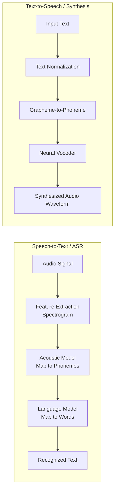
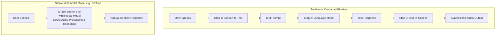

> [!WARNING]
> **Archived.** These notes predate the current AI-901 content and contain a few things
> Microsoft has since changed. The verified, up-to-date version is the interactive site in
> this repository. See [notes/README.md](./README.md) for the specific corrections.

# 04 - Speech Recognition, Speech Synthesis & Multimodal Voice

This module covers speech processing principles, speech recognition, neural speech synthesis, multimodal spoken prompt handling, Azure Speech in Foundry Tools, and hands-on Python SDK client implementations for **Exam AI-901: Microsoft Azure AI Fundamentals**.

---

## Table of Contents

- [04 - Speech Recognition, Speech Synthesis \& Multimodal Voice](#04---speech-recognition-speech-synthesis--multimodal-voice)
  - [Table of Contents](#table-of-contents)
  - [1. Fundamentals of Speech Processing](#1-fundamentals-of-speech-processing)
    - [Acoustic Signals \& Audio Sampling](#acoustic-signals--audio-sampling)
    - [What are Phonemes?](#what-are-phonemes)
  - [2. Core Speech Capabilities](#2-core-speech-capabilities)
    - [Speech Recognition (Speech-to-Text / ASR)](#speech-recognition-speech-to-text--asr)
    - [Speech Synthesis (Text-to-Speech / TTS)](#speech-synthesis-text-to-speech--tts)
    - [Speech Synthesis Markup Language (SSML)](#speech-synthesis-markup-language-ssml)
    - [Speech Translation](#speech-translation)
  - [3. Responding to Spoken Prompts with Multimodal Models](#3-responding-to-spoken-prompts-with-multimodal-models)
    - [Traditional Cascaded Pipeline vs. Native Multimodal Audio](#traditional-cascaded-pipeline-vs-native-multimodal-audio)
  - [4. Azure Speech in Foundry Tools](#4-azure-speech-in-foundry-tools)
  - [5. Practical Implementation (Python SDK)](#5-practical-implementation-python-sdk)
    - [Workflow 1: Recognizing Speech from Audio (Speech-to-Text)](#workflow-1-recognizing-speech-from-audio-speech-to-text)
    - [Workflow 2: Synthesizing Text to Spoken Audio (Text-to-Speech)](#workflow-2-synthesizing-text-to-spoken-audio-text-to-speech)
  - [6. Exam Essentials \& Review Points](#6-exam-essentials--review-points)

---

## 1. Fundamentals of Speech Processing

Speech processing is the technology that converts spoken acoustic signals into machine-readable representations (text, intents, or features) and synthesizes artificial human speech from written text.

### Acoustic Signals & Audio Sampling

- **Continuous Analog Waves**: Sound travels as continuous air pressure vibrations with varying frequency (pitch) and amplitude (loudness).
- **Digitization / Sampling**:
  - To be processed by computers, analog audio is digitized through **sampling** (capturing signal amplitude at discrete time intervals).
  - *Sample Rate*: Frequency of captures per second (e.g., 16 kHz = 16,000 samples/sec, common standard for speech models).
  - *Bit Depth*: Precision of each amplitude sample (e.g., 16-bit PCM).
- **Spectrograms**: Visual 2D representations of audio frequencies plotted over time, often used as inputs into deep learning acoustic models.

### What are Phonemes?

- A **phoneme** is the smallest perceptually distinct unit of sound in a specified spoken language that distinguishes one word from another.
- Example: The word `"cat"` consists of three distinct phonemes: `/k/`, `/æ/`, `/t/`.
- Speech recognition models translate acoustic waveforms into sequences of phonemes, which are then assembled into text words.

---

## 2. Core Speech Capabilities



### Speech Recognition (Speech-to-Text / ASR)

- **Automatic Speech Recognition (ASR)** transcribes spoken words into written text.
- **Processing Steps**:
  1. Capture analog audio waveform via microphone or audio file.
  2. Filter background noise and extract frequency features over time (spectrogram).
  3. Map acoustic features to probable phonemes using deep neural acoustic models.
  4. Use language models to evaluate word probabilities and grammar context to generate text tokens.
- **Modes**:
  - *Real-Time Speech-to-Text*: Continuously transcribes streaming audio as speech occurs (used in voice assistants, live subtitles, and meeting captions).
  - *Batch Transcription*: Asynchronously transcribes large repositories of pre-recorded audio files stored in Azure Blob Storage.

### Speech Synthesis (Text-to-Speech / TTS)

- **Text-to-Speech (TTS)** converts written text into synthesized spoken audio waveforms.
- **Neural Text-to-Speech**:
  - Leverages deep neural networks (neural vocoders) to generate speech that is virtually indistinguishable from human recordings.
  - Accurately captures human prosody, stress, intonation patterns, and cadence.
- **Voice Options**:
  - *Prebuilt Neural Voices*: Highly expressive voices available in hundreds of languages and regional dialects.
  - *Custom Neural Voice*: A branded, unique synthetic voice trained on recorded studio samples of a human voice actor.

### Speech Synthesis Markup Language (SSML)

**SSML** is an XML-based standard that allows developers to fine-tune synthesized speech attributes:

```xml
<speak version="1.0" xmlns="http://www.w3.org/2001/10/synthesis" xml:lang="en-US">
    <voice name="en-US-AvaNeural">
        <prosody rate="-10%" pitch="+5Hz">
            Welcome to Microsoft Foundry.
        </prosody>
        <break time="500ms" />
        <emphasis level="strong">How can I assist your team today?</emphasis>
    </voice>
</speak>
```

Key SSML tags:
- `<voice>`: Specifies the neural voice identity and language.
- `<prosody>`: Adjusts pitch, speaking rate, and volume.
- `<break>`: Inserts intentional pauses with millisecond precision.
- `<emphasis>`: Adds stress and intonation to specific phrases.

### Speech Translation

- Enables real-time multilingual communication by translating speech from one spoken language directly into translated text or synthesized speech in another language (e.g., English speech $\rightarrow$ Spanish audio).

---

## 3. Responding to Spoken Prompts with Multimodal Models

A key advancement tested in Exam AI-901 is the ability of modern foundation models (such as GPT-4o) deployed in Microsoft Foundry to natively handle spoken prompts.

### Traditional Cascaded Pipeline vs. Native Multimodal Audio



| Dimension | Cascaded Pipeline (STT $\rightarrow$ LLM $\rightarrow$ TTS) | Native Multimodal Model (e.g., GPT-4o) |
| :--- | :--- | :--- |
| **Latency** | Higher (sums latency of three independent services) | Significantly lower latency; enables natural conversational turn-taking |
| **Acoustic Context** | Tone, emotion, whispering, pitch, and sarcasm are lost when converted to text | Retains emotional nuance, laughter, pacing, and auditory background context |
| **Output Flexibility** | Rigid synthetic output constrained by text generation | Can sing, whisper, alter accents, or adjust emotion dynamically based on audio input |

---

## 4. Azure Speech in Foundry Tools

Within Microsoft Foundry, **Azure Speech** is integrated into Foundry Tools, allowing developers to:
- Test neural voices interactively in the **Foundry Speech Playground**.
- Integrate speech capabilities into conversational AI agents.
- Access speech transcription and synthesis APIs alongside model deployments.

---

## 5. Practical Implementation (Python SDK)

Exam AI-901 requires knowledge of Python client code for speech recognition and speech synthesis using the Azure Speech SDK (`azure-cognitiveservices-speech`).

### Workflow 1: Recognizing Speech from Audio (Speech-to-Text)

```python
import os
import azure.cognitiveservices.speech as speechsdk

# 1. Configure speech service with key and region
speech_key = os.environ.get("AZURE_SPEECH_KEY")
service_region = os.environ.get("AZURE_SPEECH_REGION")

speech_config = speechsdk.SpeechConfig(
    subscription=speech_key,
    region=service_region
)

# 2. Configure audio input (from WAV file or default microphone)
audio_config = speechsdk.audio.AudioConfig(filename="customer_inquiry.wav")

# 3. Initialize recognizer with language
speech_recognizer = speechsdk.SpeechRecognizer(
    speech_config=speech_config,
    audio_config=audio_config,
    language="en-US"
)

# 4. Perform single-shot synchronous recognition
print("Transcribing audio...")
result = speech_recognizer.recognize_once_async().get()

# 5. Handle recognition outcome
if result.reason == speechsdk.ResultReason.RecognizedSpeech:
    print(f"Recognized: {result.text}")
elif result.reason == speechsdk.ResultReason.NoMatch:
    print("No speech could be recognized in the audio input.")
elif result.reason == speechsdk.ResultReason.Canceled:
    cancellation_details = result.cancellation_details
    print(f"Speech Recognition canceled: {cancellation_details.reason}")
```

### Workflow 2: Synthesizing Text to Spoken Audio (Text-to-Speech)

```python
import os
import azure.cognitiveservices.speech as speechsdk

# 1. Configure speech service
speech_key = os.environ.get("AZURE_SPEECH_KEY")
service_region = os.environ.get("AZURE_SPEECH_REGION")

speech_config = speechsdk.SpeechConfig(
    subscription=speech_key,
    region=service_region
)

# 2. Select a Neural Voice
speech_config.speech_synthesis_voice_name = "en-US-AvaNeural"

# 3. Output to an audio file (or omit audio_config to play via default speaker)
audio_config = speechsdk.audio.AudioOutputConfig(filename="output_greeting.wav")

synthesizer = speechsdk.SpeechSynthesizer(
    speech_config=speech_config,
    audio_config=audio_config
)

# 4. Synthesize text to speech
text_to_speak = "Welcome to Microsoft Foundry. Your deployment is ready."
result = synthesizer.speak_text_async(text_to_speak).get()

if result.reason == speechsdk.ResultReason.SynthesizingAudioCompleted:
    print("Speech synthesized successfully to 'output_greeting.wav'.")
elif result.reason == speechsdk.ResultReason.Canceled:
    cancellation = result.cancellation_details
    print(f"Speech synthesis canceled: {cancellation.reason}")
```

---

## 6. Exam Essentials & Review Points

- [ ] **Phoneme Definition**: The smallest distinct acoustic unit of sound in human speech (e.g., `/k/`, `/æ/`, `/t/`).
- [ ] **SSML Capabilities**: Used to control voice pitch, speaking rate, pronunciation, volume, and pauses in Text-to-Speech.
- [ ] **Native Multimodal Audio vs. Cascaded**: Native models (like GPT-4o) process audio directly in an end-to-end model, preserving tone and emotion while reducing latency compared to the 3-step STT $\rightarrow$ LLM $\rightarrow$ TTS pipeline.
- [ ] **Real-time vs. Batch Speech Recognition**: Real-time for interactive bots and live streaming; Batch for transcribing large volumes of audio files in storage.
