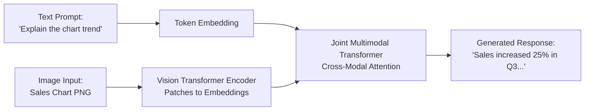

> [!WARNING]
> **Archived.** These notes predate the current AI-901 content and contain a few things
> Microsoft has since changed. The verified, up-to-date version is the interactive site in
> this repository. See [notes/README.md](./README.md) for the specific corrections.

# 05 - Computer Vision, Multimodal Vision & Image Generation

This module covers core computer vision tasks, multimodal vision models, generative image and video models, and hands-on Python SDK client implementations in Microsoft Foundry for **Exam AI-901: Microsoft Azure AI Fundamentals**.

---

## Table of Contents

- [05 - Computer Vision, Multimodal Vision \& Image Generation](#05---computer-vision-multimodal-vision--image-generation)
  - [Table of Contents](#table-of-contents)
  - [1. Fundamentals of Computer Vision](#1-fundamentals-of-computer-vision)
    - [How Computers See Images](#how-computers-see-images)
    - [Deep Learning \& Convolutional Neural Networks (CNNs)](#deep-learning--convolutional-neural-networks-cnns)
  - [2. Core Computer Vision Solution Types](#2-core-computer-vision-solution-types)
    - [Image Classification](#image-classification)
    - [Object Detection](#object-detection)
    - [Image Segmentation](#image-segmentation)
    - [Optical Character Recognition (OCR)](#optical-character-recognition-ocr)
    - [Facial Detection and Analysis](#facial-detection-and-analysis)
  - [3. Multimodal Vision Models](#3-multimodal-vision-models)
    - [How Multimodal Vision Works](#how-multimodal-vision-works)
    - [Visual Reasoning Capabilities](#visual-reasoning-capabilities)
  - [4. Generative Image and Video Models](#4-generative-image-and-video-models)
    - [Diffusion Models Explained](#diffusion-models-explained)
    - [Image Generation with DALL-E 3](#image-generation-with-dall-e-3)
  - [5. Practical Implementation (Python SDK)](#5-practical-implementation-python-sdk)
    - [Workflow 1: Multimodal Vision Prompting (Interpreting Images)](#workflow-1-multimodal-vision-prompting-interpreting-images)
    - [Workflow 2: Generating Images with DALL-E 3](#workflow-2-generating-images-with-dall-e-3)
    - [Workflow 3: Image Analysis with Azure AI Vision](#workflow-3-image-analysis-with-azure-ai-vision)
  - [6. Exam Essentials \& Review Points](#6-exam-essentials--review-points)

---

## 1. Fundamentals of Computer Vision

Computer vision enables software systems to extract meaningful information and actionable insights from digital images, videos, and visual sensor streams.

### How Computers See Images

- A digital image is represented as a multidimensional numerical grid of **pixels**:
  - **Grayscale Images**: A single 2D grid where each pixel has a single intensity value from `0` (black) to `255` (white).
  - **Color Images (RGB)**: A 3D array composed of three color channels - **Red**, **Green**, and **Blue**. Each pixel has three values ranging from `0` to `255` representing color intensity.

### Deep Learning & Convolutional Neural Networks (CNNs)

Traditional computer vision relied on hand-crafted mathematical filters. Modern computer vision relies on **Convolutional Neural Networks (CNNs)**:
- **Convolutional Layers**: Apply learned filters (kernels) that slide across the image pixels to extract low-level features (edges, corners) and higher-level abstractions (textures, shapes, eyes, wheels).
- **Pooling Layers**: Down-sample feature maps to reduce spatial dimensions while preserving key features, improving computational efficiency and invariance to small translations.
- **Fully Connected Layers**: Flatten the extracted features and output final classification probabilities or bounding box coordinates.

---

## 2. Core Computer Vision Solution Types

Exam AI-901 requires you to distinguish between five common computer vision tasks:

```mermaid
flowchart TD
    Img[Input Image]
    Img --> Class[1. Image Classification<br/>'This image contains a dog']
    Img --> Detect[2. Object Detection<br/>'Dog at [x,y,w,h], Ball at [x,y,w,h]']
    Img --> Seg[3. Image Segmentation<br/>Pixel-level mask boundaries]
    Img --> OCR[4. OCR<br/>Extract printed/handwritten text]
    Img --> Face[5. Face Detection<br/>Locate faces & detect attributes]
```

| Solution Type | Primary Function | Typical Output | Example Real-World Use Case |
| :--- | :--- | :--- | :--- |
| **Image Classification** | Categorizes an entire image into a predefined class label. | A single class label and confidence score (e.g., `forklift: 98%`). | Quality control screening (e.g., classifying a manufactured part as `defective` or `passed`). |
| **Object Detection** | Identifies and locates multiple distinct objects within a single image. | Class labels with **bounding box coordinates** `[x, y, width, height]` for each detected item. | Warehouse inventory scanning, retail checkout automation, autonomous driving obstacles. |
| **Image Segmentation** | Classifies every individual pixel in an image to define exact object shapes. | A pixel-level binary or multi-class mask covering the exact boundary of each object. | Medical imaging (measuring tumor volume in an MRI), satellite land-cover mapping. |
| **Optical Character Recognition (OCR)** | Detects and reads printed and handwritten text characters embedded in images. | Bounding polygons containing recognized text strings and reading order. | Digitizing street signs, receipts, license plate recognition. |
| **Facial Detection & Analysis** | Locates human faces and estimates non-identifying facial attributes. | Bounding box around each face, plus attributes (head pose, blur, glasses, noise, occlusion). | Photography auto-focus, smart crop thumbnails, emotion-neutral kiosk interactions. |

> [!IMPORTANT]
> **Microsoft Responsible AI Limited Access Policy**:
> Facial *detection* and non-identifying attribute estimation (e.g., detecting if a face has glasses or blur) are broadly available. However, facial *identification* and *verification* (matching a face against an identity database) are subject to Microsoft's Limited Access policy to protect individual privacy.

---

## 3. Multimodal Vision Models

### How Multimodal Vision Works

Modern foundation models (such as **GPT-4o** and **Florence-2**) are natively multimodal. Rather than using separate OCR and object detection pipelines, multimodal foundation models ingest image tokens and text tokens into the same unified transformer:



### Visual Reasoning Capabilities

- **Chart & Diagram Interpretation**: Analyzing complex infographics, flowcharts, architectural blueprints, and financial graphs.
- **Visual Question Answering (VQA)**: Answering user questions about specific image regions (*"What brand is the watch on the left person's wrist?"*).
- **Scene Understanding & Captioning**: Generating comprehensive descriptions of crowded scenes.
- **Visual Anomaly Detection**: Identifying subtle defects in manufactured components compared to expected standards.

---

## 4. Generative Image and Video Models

### Diffusion Models Explained

Modern image-generation models (such as DALL-E 3) are based on **diffusion architectures**:
1. **Forward Diffusion (Training)**: Systematic noise (Gaussian noise) is progressively added to an image until it becomes pure static.
2. **Reverse Denoising (Generation)**: The model is trained to reverse this process. Starting from random noise and conditioned on a text prompt embedding, the model iteratively removes noise step by step until a clear, high-resolution image emerges.

### Image Generation with DALL-E 3

- Generates original photorealistic or stylized artwork from natural language prompts.
- **Prompt Refinement**: When accessed via Azure OpenAI or Foundry, the model automatically refines and expands user prompts to add detail and photographic nuance.
- **Content Credentials (C2PA)**: Microsoft embeds cryptographic metadata and digital watermarks into generated images to certify that the asset was generated by an AI model (supporting the **Transparency** principle).

---

## 5. Practical Implementation (Python SDK)

Exam AI-901 expects you to know how to write Python code to submit visual prompts to multimodal models and generate images.

### Workflow 1: Multimodal Vision Prompting (Interpreting Images)

The following example shows how to send an image (as a URL or Base64 string) alongside a text question to a deployed multimodal model using the Azure AI Foundry / Inference SDK:

```python
import os
from azure.ai.inference import ChatCompletionsClient
from azure.ai.inference.models import (
    SystemMessage,
    UserMessage,
    TextContentItem,
    ImageContentItem,
    ImageUrl
)
from azure.core.credentials import AzureKeyCredential

# 1. Initialize client
endpoint = os.environ.get("AZURE_AI_FOUNDRY_ENDPOINT")
api_key = os.environ.get("AZURE_AI_FOUNDRY_KEY")

client = ChatCompletionsClient(
    endpoint=endpoint,
    credential=AzureKeyCredential(api_key)
)

# 2. Construct multimodal prompt containing text AND image
image_url = "https://raw.githubusercontent.com/Azure-Samples/cognitive-services-sample-data-files/master/ComputerVision/Images/objects.jpg"

messages = [
    SystemMessage(content="You are an expert computer vision assistant. Describe scenes with spatial awareness."),
    UserMessage(content=[
        TextContentItem(text="What objects are present in this image, and where are they located?"),
        ImageContentItem(image_url=ImageUrl(url=image_url))
    ])
]

# 3. Request completion
response = client.complete(
    messages=messages,
    max_tokens=300,
    temperature=0.2
)

# 4. Print interpretation
print(response.choices[0].message.content)
```

### Workflow 2: Generating Images with DALL-E 3

```python
import os
from openai import AzureOpenAI

# 1. Initialize Azure OpenAI client
client = AzureOpenAI(
    azure_endpoint=os.environ.get("AZURE_OPENAI_ENDPOINT"),
    api_key=os.environ.get("AZURE_OPENAI_KEY"),
    api_version="2024-02-01"
)

# 2. Call DALL-E 3 deployment
response = client.images.generate(
    model="dall-e-3",
    prompt="A futuristic smart solar panel with digital holographic data overlays in an alpine landscape, photorealistic, 8k",
    n=1,
    size="1024x1024"
)

# 3. Retrieve generated image URL
image_url = response.data[0].url
revised_prompt = response.data[0].revised_prompt
print(f"Generated Image URL: {image_url}")
print(f"Revised Prompt: {revised_prompt}")
```

### Workflow 3: Image Analysis with Azure AI Vision

For dedicated OCR and image tagging using Azure AI Vision in Foundry Tools:

```python
import os
from azure.ai.vision.imageanalysis import ImageAnalysisClient
from azure.ai.vision.imageanalysis.models import VisualFeatures
from azure.core.credentials import AzureKeyCredential

client = ImageAnalysisClient(
    endpoint=os.environ.get("VISION_ENDPOINT"),
    credential=AzureKeyCredential(os.environ.get("VISION_KEY"))
)

result = client.analyze(
    image_url="https://example.com/receipt.jpg",
    visual_features=[VisualFeatures.CAPTION, VisualFeatures.READ, VisualFeatures.TAGS]
)

if result.caption:
    print(f"Caption: {result.caption.text} (confidence: {result.caption.confidence:.2f})")

if result.read:
    print("\nDetected Text:")
    for line in result.read.blocks[0].lines:
        print(f" - {line.text}")
```

---

## 6. Exam Essentials & Review Points

- [ ] **Classification vs. Object Detection vs. Segmentation**: Classification outputs an image-level label; Object Detection outputs labels + bounding boxes; Segmentation outputs pixel-level boundary masks.
- [ ] **Bounding Boxes**: Represented as `[x, y, width, height]` coordinates.
- [ ] **Diffusion Models**: Use forward noise addition and reverse denoising to synthesize novel images from latent vectors.
- [ ] **Multimodal Prompts**: Vision foundation models accept both image content items and text content items in the same user message.
- [ ] **Content Credentials**: C2PA metadata embedded in generated images certifies AI provenance.
