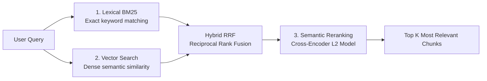
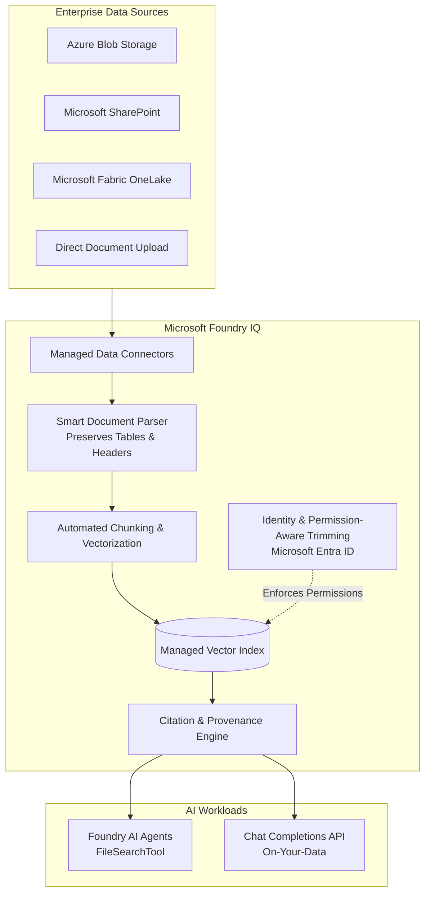
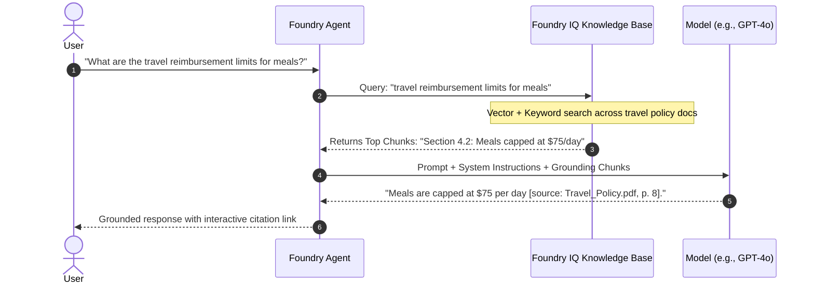

> [!WARNING]
> **Archived.** These notes predate the current AI-901 content and contain a few things
> Microsoft has since changed. The verified, up-to-date version is the interactive site in
> this repository. See [notes/README.md](./README.md) for the specific corrections.

# 07 - Retrieval-Augmented Generation (RAG) & Microsoft Foundry IQ

This module covers the architecture and lifecycle of Retrieval-Augmented Generation (RAG), vector embeddings, search strategies (vector, hybrid, semantic reranking), Microsoft Foundry IQ enterprise knowledge grounding, agent integration, and hands-on Python SDK client implementations for **Exam AI-901: Microsoft Azure AI Fundamentals**.

---

## Table of Contents

- [07 - Retrieval-Augmented Generation (RAG) \& Microsoft Foundry IQ](#07---retrieval-augmented-generation-rag--microsoft-foundry-iq)
  - [Table of Contents](#table-of-contents)
  - [1. Foundations of Retrieval-Augmented Generation (RAG)](#1-foundations-of-retrieval-augmented-generation-rag)
    - [The Need for RAG](#the-need-for-rag)
    - [Benefits of RAG vs. Fine-Tuning](#benefits-of-rag-vs-fine-tuning)
    - [The End-to-End RAG Architecture](#the-end-to-end-rag-architecture)
  - [2. The RAG Ingestion & Indexing Pipeline](#2-the-rag-ingestion--indexing-pipeline)
    - [Step 1: Document Ingestion \& Parsing](#step-1-document-ingestion--parsing)
    - [Step 2: Chunking Strategies](#step-2-chunking-strategies)
    - [Step 3: Generating Vector Embeddings](#step-3-generating-vector-embeddings)
    - [Step 4: Vector Indexing \& Storage](#step-4-vector-indexing--storage)
  - [3. Retrieval & Search Strategies](#3-retrieval--search-strategies)
    - [Lexical (Keyword) Search](#lexical-keyword-search)
    - [Vector Search (Cosine, Dot Product, Euclidean)](#vector-search-cosine-dot-product-euclidean)
    - [Hybrid Search (RRF)](#hybrid-search-rrf)
    - [Semantic Ranking (L2 Reranking)](#semantic-ranking-l2-reranking)
  - [4. Microsoft Foundry IQ](#4-microsoft-foundry-iq)
    - [What is Microsoft Foundry IQ?](#what-is-microsoft-foundry-iq)
    - [Key Capabilities of Foundry IQ](#key-capabilities-of-foundry-iq)
    - [Foundry IQ Architecture](#foundry-iq-architecture)
    - [Connecting Foundry IQ to AI Agents](#connecting-foundry-iq-to-ai-agents)
  - [5. Practical Implementation (Python SDK)](#5-practical-implementation-python-sdk)
    - [Workflow 1: Grounded Chat Completion with Data Sources](#workflow-1-grounded-chat-completion-with-data-sources)
    - [Workflow 2: Creating a Foundry Agent with File Search / Knowledge Tool](#workflow-2-creating-a-foundry-agent-with-file-search--knowledge-tool)
  - [6. Exam Essentials & Review Points](#6-exam-essentials--review-points)

---

## 1. Foundations of Retrieval-Augmented Generation (RAG)

### The Need for RAG

Large Language Models (LLMs) and Small Language Models (SLMs) possess broad world knowledge encoded during pre-training. However, they suffer from three major fundamental limitations in enterprise environments:

1. **Knowledge Cutoff**: Models have no knowledge of events, documents, or data created after their training cutoff date.
2. **Lack of Private Enterprise Data**: Models have never seen your organization's internal wikis, HR handbooks, customer tickets, financial records, or proprietary codebases.
3. **Hallucinations**: When asked questions outside their training data or when nuance is missing, models generate plausible-sounding but factually inaccurate responses.

**Retrieval-Augmented Generation (RAG)** solves these limitations by dynamically fetching relevant authoritative content from external data stores at query time and injecting it into the prompt context provided to the model.

### Benefits of RAG vs. Fine-Tuning

A frequent decision in AI solution design is whether to use RAG or Fine-Tuning:

| Dimension | Retrieval-Augmented Generation (RAG) | Fine-Tuning |
| :--- | :--- | :--- |
| **Primary Purpose** | Providing **dynamic, up-to-date, or private facts** and knowledge grounding. | Adapting **style, tone, specialized syntax, or output format** (e.g., custom code, legal formatting). |
| **Data Freshness** | Real-time / Immediate. Update the index, and the model instantly accesses new information. | Static. Requires re-training and re-deploying the model checkpoint when data changes. |
| **Hallucination Rate** | Drastically reduced. The model is instructed to cite retrieved sources. | High risk of hallucination if used to memorize facts. |
| **Source Citations** | Yes. Direct traceability back to document titles, sections, and page numbers. | No. Model cannot provide reliable page or document citations for weights. |
| **Access Control** | Supports identity-based permission trimming (e.g., role-based access to HR docs). | Not possible. Once weights are fine-tuned, all users access all encoded knowledge. |
| **Compute Cost & Complexity** | Low-to-moderate. Uses embedding models and vector search services. | High compute cost, GPU availability requirements, and specialized training pipelines. |

> [!IMPORTANT]
> **Exam Rule of Thumb**: If the goal is **facts, data recency, proprietary knowledge, or verifiable citations**, choose **RAG**. If the goal is **domain-specific style, tone, specialized jargon, or strict formatting**, choose **Fine-Tuning**. Often, both can be combined.

### The End-to-End RAG Architecture

```mermaid
flowchart TD
    subgraph Ingestion["1. Ingestion Phase (Offline / Batch)"]
        Docs[Internal Docs<br/>PDF, Word, HTML] --> Chunk[Document Chunking<br/>512 tokens + 10% overlap]
        Chunk --> Embed[Embedding Model<br/>text-embedding-3-small]
        Embed --> Index[(Vector Index /<br/>Azure AI Search)]
    end

    subgraph Inference["2. Inference Phase (Runtime / Online)"]
        UserQuery([User: 'What is our 2026 travel policy?']) --> QueryEmbed[Generate Query Vector]
        QueryEmbed --> Search[Hybrid + Semantic Search]
        Index -.-> Search
        Search --> Context[Retrieved Relevant Chunks<br/>+ Citations]
        UserQuery --> PromptEngine[Prompt Construction]
        Context --> PromptEngine
        PromptEngine --> LLM[Generative Model<br/>GPT-4o / Phi-4]
        LLM --> Response([Grounded Response<br/>with In-Line Citations [1]])
    end
```

---

## 2. The RAG Ingestion & Indexing Pipeline

Building a RAG solution requires preparing raw enterprise files for semantic indexing.

### Step 1: Document Ingestion & Parsing

Heterogeneous enterprise formats (PDFs, scanned docs, Word files, HTML, JSON, markdown) must be parsed into clean text.
- Formats with complex tables and visual layouts benefit from **Azure AI Document Intelligence** or **Azure Content Understanding** to preserve table rows, headers, and semantic reading order.

### Step 2: Chunking Strategies

LLMs have limited context windows and retrieval engines perform best when matching targeted passages rather than entire 100-page manuals. Therefore, long documents are divided into smaller pieces called **chunks**.

Common chunking strategies:
1. **Fixed-Size Chunking**:
   - Chunks are created based on a fixed character or token count (e.g., 512 tokens per chunk).
   - **Chunk Overlap**: A small percentage (typically 10–20%, e.g., 50 tokens) of text from the previous chunk is prepended to the next chunk. This prevents critical sentences from being cut in half across chunk boundaries.
2. **Paragraph / Sentence Chunking**:
   - Uses punctuation and natural document structure to create boundaries at natural semantic breaks.
3. **Semantic / Hierarchical Chunking**:
   - Uses markdown headings (`#`, `##`), section titles, or document layout models to group related paragraphs under their parent context.

```
Document: "Our vacation policy allows 20 days. [Overlap: Unused days rollover up to 5 days.] [Next Chunk: Unused days rollover up to 5 days. Rollover expires on March 31st.]"
```

### Step 3: Generating Vector Embeddings

Text chunks are transformed into mathematical arrays of floating-point numbers called **vector embeddings** using an embedding model (e.g., `text-embedding-3-small` or `text-embedding-3-large`).

- Text with similar semantic meaning will produce vector embeddings that are located close to each other in multi-dimensional space, regardless of the exact vocabulary used.
- *Example*: *"automobile repair handbook"* and *"car maintenance manual"* produce vectors with high cosine similarity, even though they share few identical keywords.

### Step 4: Vector Indexing & Storage

Vector embeddings and their associated raw text chunks, metadata (document title, URL, page number, creation date, access permissions), and keyword tokens are stored in a vector index (such as **Azure AI Search** or a **Foundry Vector Store**).

---

## 3. Retrieval & Search Strategies

When a user submits a prompt, the system queries the index to find the most relevant chunks. Azure AI Search and Microsoft Foundry support multiple search modes:



### Lexical (Keyword) Search

- Uses traditional inverted indexes and the **BM25** statistical scoring algorithm.
- Excellent at finding exact matches for product numbers, SKU codes, rare acronyms, error codes, and specific names (e.g., `ERR-90210-X`).
- Fails when users use synonyms, paraphrasing, or conceptual descriptions without matching the exact words.

### Vector Search (Cosine, Dot Product, Euclidean)

- Compares the high-dimensional query embedding to stored chunk embeddings using similarity metrics:
  - **Cosine Similarity**: Measures the cosine of the angle between two vectors; invariant to vector magnitude (most common for text).
  - **Dot Product**: Measures angle and magnitude; efficient when vectors are normalized.
  - **Euclidean Distance (L2)**: Measures straight-line distance between points.
- Captures conceptual intent, multilingual queries, and paraphrased meanings.

### Hybrid Search (RRF)

**Hybrid search combines keyword search (BM25) and vector search in a single query.**
- The search engine executes both searches in parallel against the index.
- The results are merged and re-scored using **Reciprocal Rank Fusion (RRF)**:

$$\text{RRF Score} = \sum_{m \in M} \frac{1}{k + r_m(d)}$$

- *Benefit*: Offers the best of both worlds - exact keyword precision for codes/names and dense vector semantic matching for broad concepts.

### Semantic Ranking (L2 Reranking)

After Hybrid Search retrieves the top candidate documents (e.g., top 50), an optional **Semantic Ranker** applies a secondary deep-learning cross-encoder model:
- Re-scores passages based on semantic relevance, intent, and readability.
- Re-orders the results so the most contextually relevant passages move to the very top (e.g., positions 1–5).
- Generates **semantic captions** and **semantic highlights** highlighting the exact sentences that answer the query.

| Search Technique | Best Used For |
| :--- | :--- |
| **Lexical (Keyword)** | Part numbers, error codes, exact proper nouns, verbatim strings. |
| **Vector Search** | Conceptual queries, synonyms, multilingual search, thematic queries. |
| **Hybrid Search** | Production enterprise systems needing both keyword accuracy and semantic recall. |
| **Hybrid + Semantic Ranking** | **Gold standard for RAG**: Maximizes top-K precision before feeding chunks into the LLM context. |

---

## 4. Microsoft Foundry IQ

### What is Microsoft Foundry IQ?

**Microsoft Foundry IQ** is the managed enterprise knowledge retrieval and grounding layer built into **Microsoft Foundry**. 

Foundry IQ eliminates the need for developers to manually build custom chunking, embedding, vector storage, and query orchestration pipelines by offering a unified, enterprise-grade knowledge engine.



### Key Capabilities of Foundry IQ

1. **Enterprise Data Grounding**:
   - Connects directly to Azure Blob Storage, Azure Data Lake Storage Gen2, Microsoft Fabric OneLake, SharePoint, and local files.
   - Automatically synchronizes when underlying documents are added, updated, or deleted.

2. **Automated Document Intelligence**:
   - Uses built-in layout analyzers to parse complex documents (multi-column layouts, tables, embedded images, headers/footers) without losing context.

3. **Permission-Aware Retrieval (Security & ACL Trimming)**:
   - Integrates with **Microsoft Entra ID**.
   - Respects user access control lists (ACLs). When a user asks an AI agent a question, Foundry IQ filters the retrieved chunks so users only receive answers generated from documents they have permission to read.

4. **In-Line Citations & Auditability**:
   - Automatically formats retrieved sources into verifiable citations (e.g., `[doc1.pdf, page 4]`).
   - Every claim made by the model can be traced back to the original source text, critical for compliance and trustworthiness.

5. **Hallucination Mitigation**:
   - Enforces grounding system instructions to ensure the model responds solely based on verified retrieved facts.

### Foundry IQ Architecture

Foundry IQ acts as the knowledge middleware between enterprise data stores and generative AI models:
- **Knowledge Base Asset**: Within a Microsoft Foundry project, a knowledge base is configured with connections to storage, an embedding model deployment, and index settings.
- **Foundry Tools Integration**: A knowledge base can be exposed to AI agents as a callable tool (e.g., `KnowledgeTool` or `AzureAISearchTool`).

### Connecting Foundry IQ to AI Agents

In Microsoft Foundry, you connect knowledge to an Agent by attaching a **Search / Knowledge Tool**:



---

## 5. Practical Implementation (Python SDK)

### Workflow 1: Grounded Chat Completion with Data Sources

You can query a model deployed in Microsoft Foundry while grounding responses on an Azure AI Search index using the `extra_body` configuration in the Azure OpenAI / Foundry Chat Completions API.

```python
import os
from openai import AzureOpenAI

# Initialize Azure OpenAI / Foundry client
client = AzureOpenAI(
    azure_endpoint=os.environ["AZURE_FOUNDRY_ENDPOINT"],
    api_key=os.environ["AZURE_FOUNDRY_API_KEY"],
    api_version="2024-06-01"
)

# Call chat completion with on-your-data grounding
response = client.chat.completions.create(
    model="gpt-4o",
    messages=[
        {
            "role": "system",
            "content": "You are an enterprise HR assistant. Answer questions ONLY using the provided search sources. If you do not know the answer, say you do not know. Always cite your sources."
        },
        {
            "role": "user",
            "content": "What is the policy for parental leave?"
        }
    ],
    # Attach external knowledge via Azure AI Search / Foundry IQ
    extra_body={
        "data_sources": [
            {
                "type": "azure_search",
                "parameters": {
                    "endpoint": os.environ["AZURE_SEARCH_ENDPOINT"],
                    "index_name": "hr-policies-index",
                    "authentication": {
                        "type": "api_key",
                        "key": os.environ["AZURE_SEARCH_KEY"]
                    },
                    "query_type": "vector_semantic_hybrid",
                    "semantic_configuration": "default",
                    "embedding_dependency": {
                        "type": "deployment_name",
                        "deployment_name": "text-embedding-3-small"
                    }
                }
            }
        ]
    }
)

# Extract grounded answer and citations
message = response.choices[0].message
print("Answer:")
print(message.content)

# Inspect citations generated by the grounding engine
context_info = message.model_extra.get("context", {})
citations = context_info.get("citations", [])
print(f"\nRetrieved {len(citations)} source citations:")
for idx, citation in enumerate(citations, 1):
    print(f"[{idx}] {citation.get('title', 'Unknown')} (filepath: {citation.get('filepath')})")
```

### Workflow 2: Creating a Foundry Agent with File Search / Knowledge Tool

Using the **`azure-ai-projects`** SDK, you can create a vector store, upload enterprise files, and attach a `FileSearchTool` to an AI Agent.

```python
import os
from azure.ai.projects import AIProjectClient
from azure.ai.projects.models import FileSearchTool
from azure.identity import DefaultAzureCredential

# 1. Connect to Microsoft Foundry Project
project_client = AIProjectClient.from_connection_string(
    credential=DefaultAzureCredential(),
    conn_str=os.environ["FOUNDRY_PROJECT_CONNECTION_STRING"]
)

# 2. Upload enterprise document to Foundry Project
uploaded_file = project_client.agents.upload_file_and_poll(
    file_path="company_handbook.pdf",
    purpose="assistants"
)
print(f"Uploaded file ID: {uploaded_file.id}")

# 3. Create a Vector Store and attach the uploaded file
vector_store = project_client.agents.create_vector_store_and_poll(
    file_ids=[uploaded_file.id],
    name="company-policies-vectorstore"
)
print(f"Vector Store created: {vector_store.id}")

# 4. Instantiate the File Search Tool with the Vector Store
file_search_tool = FileSearchTool(vector_store_ids=[vector_store.id])

# 5. Create the AI Agent with the attached knowledge tool
agent = project_client.agents.create_agent(
    model="gpt-4o",
    name="policy-assistant-agent",
    instructions=(
        "You are an enterprise knowledge assistant. Answer employee questions "
        "truthfully and concisely based ONLY on files attached to your vector store. "
        "Include file citations for every policy cited."
    ),
    tools=file_search_tool.definitions,
    tool_resources=file_search_tool.resources
)
print(f"Created Agent '{agent.name}' (ID: {agent.id}) with Vector Store attached.")

# 6. Execute a query with the Agent
thread = project_client.agents.create_thread()
message = project_client.agents.create_message(
    thread_id=thread.id,
    role="user",
    content="How many days of remote work are permitted per week?"
)

run = project_client.agents.create_and_process_run(
    thread_id=thread.id,
    assistant_id=agent.id
)

# 7. Print agent messages and source citations
messages = project_client.agents.list_messages(thread_id=thread.id)
latest_message = messages.get_last_text_message_by_role("assistant")
print(f"\nAgent Response:\n{latest_message.text.value}")
```

---

## 6. Exam Essentials & Review Points

Use this quick checklist to test your understanding before taking the AI-901 exam:

| Concept / Term | Exam Definition & Crucial Distinction |
| :--- | :--- |
| **RAG** | Retrieval-Augmented Generation: dynamic retrieval of external data injected into the prompt context at inference time to ground responses and prevent hallucinations. |
| **RAG vs. Fine-Tuning** | Choose **RAG** for new/private facts, dynamic updates, and verifiable citations. Choose **Fine-Tuning** for custom tone, specialized style, and strict output formatting. |
| **Chunking** | Splitting large documents into smaller text passages. Overlapping chunks (10–20%) prevents loss of context across boundaries. |
| **Vector Embeddings** | High-dimensional numerical representations of text; captures semantic meaning so semantically similar concepts are close in vector space. |
| **Embedding Models** | Models like `text-embedding-3-small` used to generate vector embeddings (distinct from generative chat models). |
| **BM25 Search** | Classic inverted index lexical keyword search; ideal for exact part numbers, error codes, and unique identifiers. |
| **Vector Search** | Similarity search (Cosine similarity, Dot product) finding conceptually related content regardless of keyword overlap. |
| **Hybrid Search** | Combining BM25 keyword search and dense vector search using **Reciprocal Rank Fusion (RRF)**. |
| **Semantic Ranking (L2)** | A secondary deep-learning cross-encoder model applied on top search results to re-order and surface the most relevant passages. |
| **Microsoft Foundry IQ** | The managed knowledge layer in Microsoft Foundry that provides enterprise data connectors, automatic parsing/chunking, permission-aware retrieval, and citation generation. |
| **Permission-Aware Retrieval** | Enforcing user access controls (via Microsoft Entra ID) so that AI responses only reflect documents the requesting user is authorized to read. |
| **Citations** | Grounded references (document name, page number, passage) embedded in generated responses that allow users to verify the source of factual statements. |
| **Foundry FileSearchTool** | Agent tool in `azure-ai-projects` that connects an AI Agent to a vector store containing chunked and indexed documents. |
